# Vulnix (HackLAB) — VulnHub Walkthrough

My notes from rooting the Vulnix VM off VulnHub. It's tagged as a
misconfiguration box, and that's exactly how it plays out — I didn't need a
single exploit or buffer overflow, just a chain of bad NFS, rlogin, and sudo
settings. Getting root came down to reading the config carefully and abusing
what was already there.

Target VM: https://www.vulnhub.com/entry/hacklab-vulnix,48/

- Target: `10.10.10.132` (Ubuntu 12.04.1 LTS)
- Attacker: Kali (`10.10.10.128`)
- Flag: `cc614640424f5bd60ce5d5264899c3be`

The full formal report (with CVSS scoring, all findings, and the complete Part B
writeup) is in this repo as **`Vulnix_Penetration_Testing_Report_final.pdf`**.
The hardening script is **`fix-vulnix.sh`**.

---

## Part A — Getting in

### Recon

Started with a ping sweep to find the box, then a full service scan.

```bash
nmap -sn 10.10.10.128/24
sudo nmap -sV -sC -p- 10.10.10.132
```

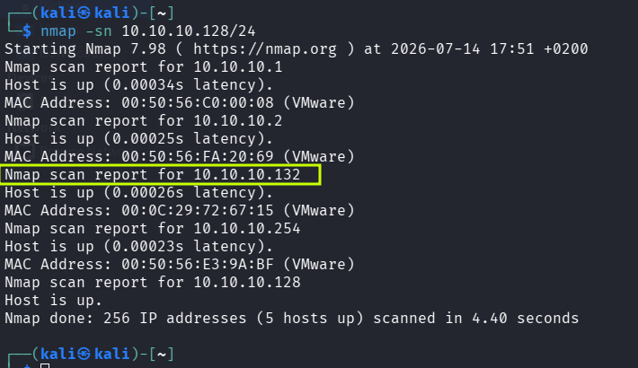

The interesting stuff: NFS on 2049, RPC on 111, the old r-services on
512/513/514, and SSH on 22.

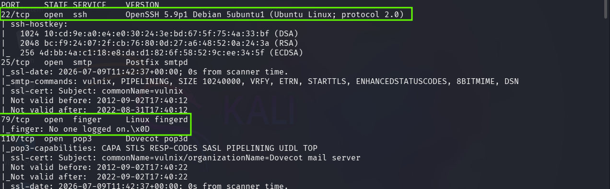

I also ran a Nessus scan for good measure — it flagged the NFS export and the
Ubuntu 12.04 end-of-life, which lined up with what I was seeing manually.

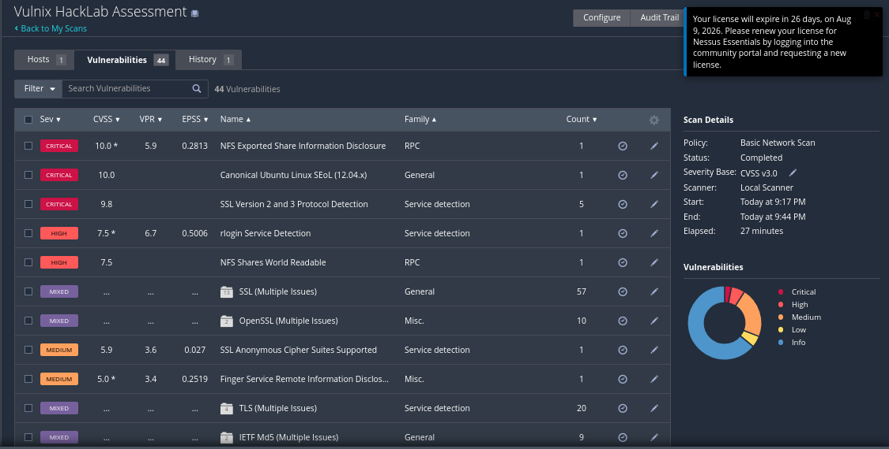

### NFS enumeration

`showmount` showed `/home/vulnix` was shared out to everyone (`*`). No host
restriction at all.

```bash
showmount -e 10.10.10.132
```

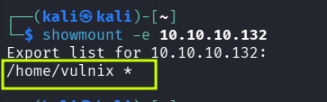

### UID spoofing for the foothold

Mounting worked but I couldn't read anything — `root_squash` was knocking my
root down to `nobody`. The folder belonged to UID 2008. Since NFSv3 just trusts
whatever UID the client claims, I made a local user with that same UID and
suddenly I owned the files.

```bash
sudo mount -t nfs 10.10.10.132:/home/vulnix /mnt/vulnix
sudo useradd -u 2008 -m temp_nfs_user
sudo su - temp_nfs_user
```

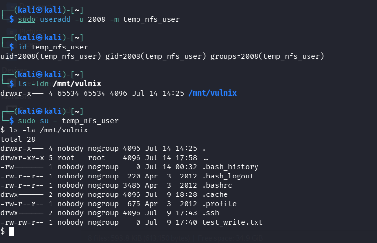

Now that I could write to the home directory, I dropped in an SSH key and a
`.rhosts` file with `+ +` in it (which basically means "trust anyone").

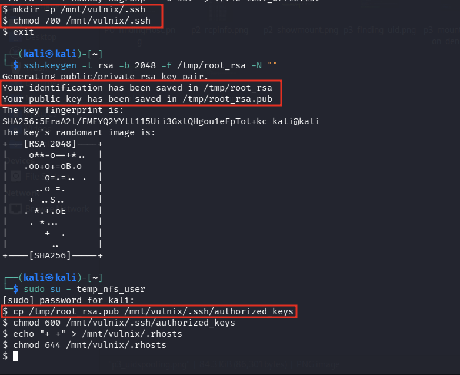

### Shell as vulnix

The `.rhosts` file did its job — rlogin let me straight in as vulnix, no
password.

```bash
rlogin -l vulnix 10.10.10.132
```

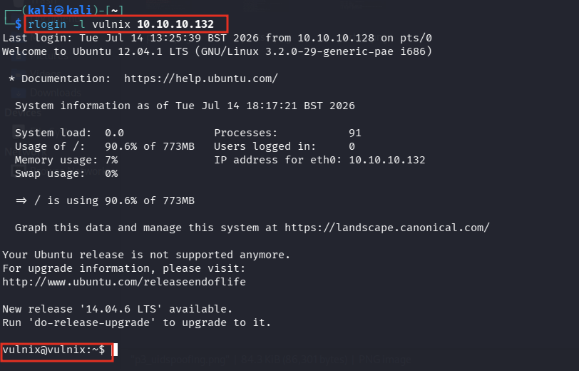

### Privilege escalation

First thing I checked was `sudo -l`. There it was — vulnix could run
`sudoedit /etc/exports` as root with no password.


So I edited the exports file and added `/root` with `no_root_squash`, which
disables the protection that normally stops a remote root from acting as root.

```bash
sudoedit /etc/exports
# added:  /root *(rw,no_root_squash)
```

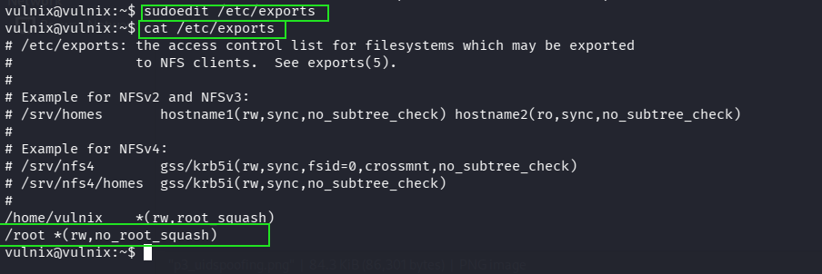

### Rooting the box

vulnix couldn't reload NFS, so I rebooted the VM to force the config to reload.
After that, `/root` was exported. With `no_root_squash` set, my local root kept
its privileges on the mount, so I wrote an SSH key straight into
`/root/.ssh/authorized_keys` and logged in as root.

```bash
showmount -e 10.10.10.132
sudo mount -t nfs 10.10.10.132:/root /mnt/vulnix_root
sudo cp mykey.pub /mnt/vulnix_root/.ssh/authorized_keys
ssh -i mykey root@10.10.10.132
cat trophy.txt
```

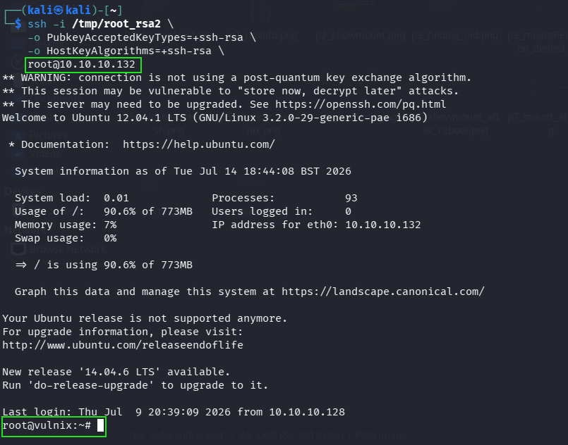
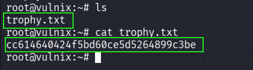

---

## Findings

The things that made this chain possible:

- rlogin was running, and `.rhosts` trust let me in with no auth
- `/home/vulnix` was NFS-exported to `*` with no host restriction
- NFSv3 trusts client UIDs, so I bypassed permissions by matching UID 2008
- vulnix had a passwordless `sudoedit` on `/etc/exports`
- exporting `/root` with `no_root_squash` handed over root

---

## Part B — Locking it down

I wrote `fix-vulnix.sh` to fix the whole chain, not just the exact steps I used.
The idea was to kill the categories of problem: shut off the legacy services,
lock down the exports, strip the bad sudo rule, remove the trust files, harden
SSH, and firewall the ports as a backstop.

To run it on the target as root:

```bash
# make it executable first (Git and editors often drop the +x bit),
# or just run it with bash:
chmod +x fix-vulnix.sh
bash fix-vulnix.sh
```

What it does:

1. Disables rlogin/rsh/rexec in inetd
2. Removes the `/root` export and restricts `/home/vulnix` to localhost, read-only
3. Reloads the exports with `exportfs -ra`
4. Deletes vulnix's sudo rule
5. Removes `.rhosts` files and clears the planted authorized_keys
6. Sets `PermitRootLogin no` and turns off rhosts-style SSH trust
7. Adds iptables rules dropping the NFS and r-service ports (keeps SSH open)

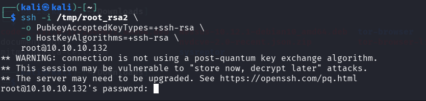

---

## Checking the fixes held

I went back and re-ran the same attacks. Everything that worked before now fails.

- rlogin: connection refused
- showmount: RPC timeout (firewall)
- `sudo -l` for vulnix: not allowed
- authorized_keys: empty
- root SSH: blocked by PermitRootLogin no
- nmap of the NFS/r-service ports: all filtered

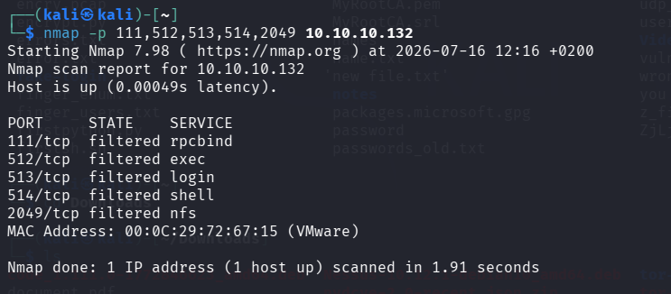
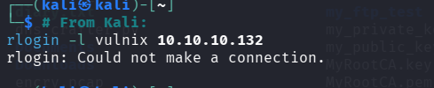

Even if someone got a vulnix shell some other way, the escalation path is gone —
no sudo rule, no `.rhosts`, no writable exports, and the firewall blocks a
remote NFS remount.

---

## Takeaways

- NFSv3 "access control" by UID isn't authentication. Matching a UID locally
  walks right past it. Kerberos or `all_squash` is the real fix.
- `no_root_squash` on a wildcard export is basically a root backdoor.
- One loose `NOPASSWD` sudo entry on the wrong file is all it takes.
- Killing a whole service class beats patching one config line.
- rlogin and `.rhosts` shouldn't exist on anything modern.

---

Done in an isolated lab against a deliberately vulnerable VM, for practice.
